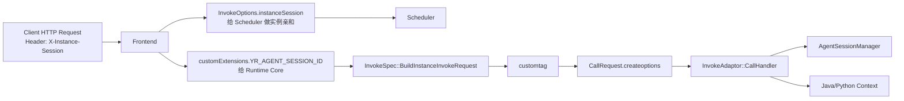
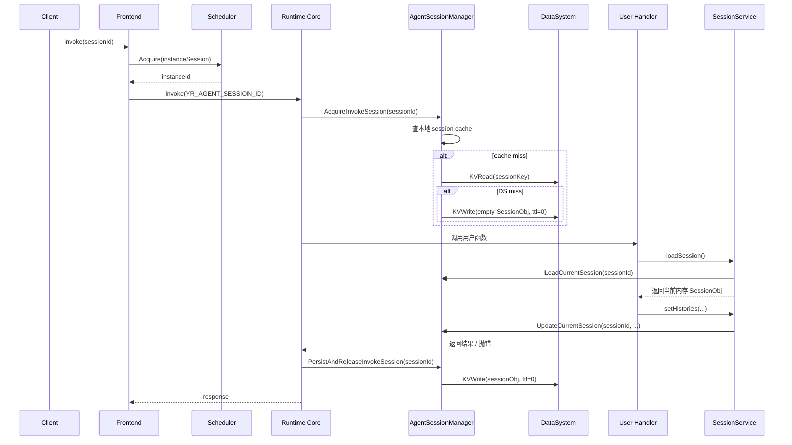

# SessionService / Agent Session 设计方案

## 1. 目标

本文档只覆盖 [支持agent.md](./支持agent.md) 中“提供 session 抽象，session 自动管理和高性能 session 共享”这一部分，重点对应以下需求：

1. runtime 调用支持 session 信息传递。
2. 当 `use_agent_session=true` 时，runtime 在调用前自动获取 session 锁，并执行 `getOrCreate sessionObj`。
3. 用户函数退出后，runtime 自动 `save sessionObj` 并释放锁。
4. Java / Python Runtime SDK 只提供 `SessionService.loadSession()` 读取当前会话对象。

本方案不覆盖 wait/notify、interrupt、session 迁移细节；这些能力复用同一份 session 基础设施，但属于后续设计。

## 2. 背景与边界

当前系统已有一条旧链路：`instanceSession` 通过 `X-Instance-Session` 进入调度层，用于实例亲和。这个 session 的职责是“把相同 sessionId 的请求调度到同一个实例”，不是直接给用户代码读写的业务对象。

本方案新增的是 **Agent SessionObj**：

- 调度层继续使用旧 `instanceSession` 做实例亲和。
- runtime 侧新增 `SessionObj` 内存对象和持久化逻辑。
- Java / Python 只读取 runtime 当前已经加载好的 `SessionObj`，不直接操作 DataSystem。

因此需要明确区分两层：

- `instanceSession`：调度亲和元数据，已有能力。
- `SessionObj`：运行时共享上下文，新增能力。

## 3. 需求拆解

### 3.1 session 信息传递

调用过程中需要同时传两类 session 信息：

1. 给 Scheduler 的亲和信息  
   复用现有 `InvokeOptions.instanceSession{sessionID, sessionTTL, concurrency}`。

2. 给 Runtime Core 的执行信息  
   新增保留字段，经 `customExtensions -> customtag -> CallRequest.createoptions` 透传：

```text
YR_AGENT_SESSION_ID
```

`use_agent_session` 由函数元信息下发到 runtime 环境变量，runtime 在实例启动时读取并缓存。

### 3.2 runtime 自动管理

当 `use_agent_session=true` 时：

1. 进入用户函数前先获取该 `sessionId` 的本地锁。
2. 锁内执行 `getOrCreate sessionObj`：
   - 本地缓存命中，直接使用。
   - 本地缓存未命中，先读 DataSystem。
   - DataSystem 也未命中，则创建空 `SessionObj`，并立即写回 DataSystem。
3. 用户函数执行期间，SDK `loadSession()` 返回这份内存中的 `SessionObj`。
4. 用户函数退出后，runtime 自动将当前 `SessionObj` 保存回 DataSystem。
5. 最后释放 session 锁。

这里不再使用 TTL 续期逻辑。Agent session 在 DataSystem 中统一使用 `ttlSecond=0`，由后续显式清理流程删除。

### 3.3 SDK 只提供 load

SDK 不提供 `saveSession()`，也不要求用户 `new SessionObj(...)`。原因是：

- `SessionObj` 的创建和保存由 runtime 自动完成。
- 用户只应该拿到“当前调用对应的 session”并修改它。
- 这样可以保证同一 session 的修改始终在锁保护下完成。
- `loadSession()` 对外不需要再传 `sessionId`，但 SDK 内部会使用 `Context.getSessionId()` 调 native `LoadCurrentSession(sessionId)`。

## 4. Session 抽象

### 4.1 SDK 对外接口

Java：

```java
public interface Context {
    String getSessionId();
    SessionService getSessionService();
}

public interface SessionService {
    SessionObj loadSession() throws YRException;
}

public interface SessionObj {
    String getID();
    List<String> getHistories();
    void setHistories(List<String> histories);
}
```

Python：

```python
class Context:
    def get_session_id(self) -> str: ...
    def get_session_service(self) -> "SessionService": ...

class SessionService:
    def load_session(self) -> "SessionObj | None": ...

class SessionObj:
    def get_id(self) -> str: ...
    def get_histories(self) -> list[str]: ...
    def set_histories(self, histories: list[str]) -> None: ...
```

### 4.2 语义约束

- `loadSession()` 只返回当前 `Context.sessionId` 对应的 session。
- 当前请求没有携带 `sessionId`，或 `use_agent_session=false` 时，返回 `null/None`。
- 在 `use_agent_session=true` 的正常链路下，`loadSession()` 一定返回对象。
- `getHistories()` 返回快照副本或只读视图，不能直接作为可写内部引用暴露。
- 用户修改历史后，必须通过 `setHistories()` 回写，SDK 才能把变更同步给 libruntime。

## 5. 数据模型与缓存

### 5.1 DataSystem 存储

Key：

```text
yr:agent_session:v1:{projectId}:{package}:{functionName}:{sessionId}
```

Value：

```json
{
  "sessionID": "s-123",
  "histories": [
    "user: hello",
    "assistant: hi"
  ]
}
```

写入参数：

```text
ttlSecond = 0
```

`ttlSecond=0` 表示 key 不自动过期，只能通过显式删除清理。

### 5.2 runtime 本地缓存

runtime 新增 `AgentSessionManager`，维护：

```cpp
struct AgentSessionValue {
    std::string sessionID;
    std::string sessionKey;
    std::string sessionData;
};

struct AgentSessionContext {
    std::mutex mutex;
    AgentSessionValue value;
    bool loaded = false;
};
```

核心作用：

- `sessionMap` 按完整 `sessionKey` 缓存持久化对象，避免跨函数同名 `sessionId` 串数据。
- `activeSessionMap` 按 `sessionId` 维护当前活跃调用，供 SDK `LoadCurrentSession(sessionId)` / `UpdateCurrentSession(sessionId, ...)` 读取。
- 为同一 `sessionId` 提供本地互斥。
- 在实例内缓存 `SessionObj`，避免每次 `loadSession()` 都访问 DataSystem。
- 让 Java / Python `loadSession()` 返回同一份内存对象，实现高性能共享。

## 6. 总体调用链

### 6.1 session 信息传递链路



说明：

- 旧 `instanceSession` 链路继续保留，不改调度语义。
- 新增 `YR_AGENT_SESSION_ID` 只服务 runtime 侧自动锁和自动保存。

### 6.2 runtime 自动管理链路



## 7. Runtime 设计

### 7.1 关键原则

- `SessionObj` 的创建、加载、保存全部在 runtime 内部自动完成。
- `loadSession()` 只是读取 runtime 当前已持有的对象，不直接访问 DataSystem。
- SDK 对 `SessionObj` 的变更必须先同步回 libruntime，最终持久化仍由 runtime 自动完成。
- 同一 `sessionId` 在同一实例内串行执行，避免并发写冲突。
- DataSystem 是持久化和恢复来源，不是热路径的主读源。

### 7.2 推荐实现方式

`InvokeAdaptor::CallHandler()` 中显式执行 session 生命周期：

```cpp
auto sessionErr = agentSessionManager->AcquireInvokeSession(req->Immutable(), metaData);
auto res = Call(req->Immutable(), metaData, librtConfig->libruntimeOptions, objectsInDs);
auto saveErr = agentSessionManager->PersistAndReleaseInvokeSession(sessionId);
```

`AcquireInvokeSession()` 行为：

1. 检查 `use_agent_session` 是否启用。
2. 从 `createoptions` 读取 `YR_AGENT_SESSION_ID`。
3. 获取该 session 的本地锁。
4. 执行 `getOrCreate`，并把结果放入 `AgentSessionContext`。

`PersistAndReleaseInvokeSession(sessionId)` 行为：

1. 将内存中的 `SessionObj` 序列化。
2. `KVWrite(sessionKey, value, ttl=0)`。
3. 释放 session 锁。

这样可以保证：

- 用户函数正常返回时会自动保存。
- 保存和解锁时机在 runtime core 中显式可见，调用路径更直接。
- 不需要在 Java / Python 层分别补一套保存逻辑。

### 7.3 自动创建语义

首次请求即使用户没有调用 `loadSession()`，runtime 也会在调用前完成 `getOrCreate`。因此：

- 同一 session 的第一条请求天然会得到一个空 `SessionObj`。
- 用户是否调用 `loadSession()` 不影响 session 生命周期。
- 请求结束后 runtime 仍会执行一次自动保存。

## 8. Java / Python SDK 设计

### 8.1 Java

改造点：

- `api/java/function-common/src/main/java/org/yuanrong/services/runtime/Context.java`
- `api/java/function-common/src/main/java/org/yuanrong/services/runtime/action/ContextImpl.java`
- `api/java/yr-runtime/src/main/java/org/yuanrong/executor/FaaSHandler.java`

设计：

- `FaaSHandler` 从请求 header 中解析 `sessionId`，注入 `ContextImpl`。
- `ContextImpl` 新增 `sessionId` 与 `SessionService` 字段。
- `SessionService.loadSession()` 通过 JNI 调用 `LoadCurrentSession(sessionId)`。
- `SessionObj.setHistories()` 通过 JNI 调用 `UpdateCurrentSession(sessionId, sessionJson)`，把最新值同步回 libruntime。

### 8.2 Python

改造点：

- `api/python/yr/functionsdk/context.py`
- `api/python/yr/executor/faas_executor.py`

设计：

- `faas_executor.py` 从请求 header 中解析 `sessionId`，注入 `Context`。
- `Context` 新增 `get_session_id()`、`get_session_service()`。
- `SessionService.load_session()` 通过 Python bridge 调用 `load_current_session(sessionId)`。
- `SessionObj.set_histories()` 通过 Python bridge 调用 `update_current_session(sessionId, session_json)`，把最新值同步回 libruntime。

### 8.3 loadSession 的实现边界

`loadSession()` 不直接查 DataSystem，而是：

1. 使用 `Context.sessionId` 调 native `LoadCurrentSession(sessionId)`。
2. libruntime 从 `activeSessionMap[sessionId]` 读取当前活跃 `AgentSessionContext`。
3. 返回这份内存 `SessionObj` 的语言包装对象。
4. 同一次调用中重复执行 `loadSession()`，返回同一个受管 proxy。

因此它本质上仍然是“取当前调用对应的 session 引用”，不是“任意按 sessionId 远程查询 DataSystem”。

### 8.4 SDK 更新如何通知 libruntime

`SessionObj` 不能设计成普通 DTO；它必须是受管代理对象。推荐语义如下：

1. `loadSession()` 返回 `ManagedSessionObj`。
2. `ManagedSessionObj` 内部持有 `sessionId`。
3. `getHistories()` 返回副本，避免用户直接修改内部列表而绕过同步。
4. `setHistories()` 先更新 SDK 本地字段，再立即调用 bridge `UpdateCurrentSession(sessionId, sessionJson)`。
5. `UpdateCurrentSession()` 只更新 libruntime 内存中的 `AgentSessionContext`，不直接写 DataSystem。
6. 请求结束时，runtime core 再统一做一次 `PersistAndReleaseInvokeSession(sessionId)`。

这样拆分后：

- SDK 修改能立刻通知 libruntime。
- DataSystem 写路径仍只有 runtime 一处，避免 Java/Python 各自写一份。
- 即使用户函数后续抛错，libruntime 里也已经持有本次最新 session 数据。

## 9. 代码落点

### 9.1 现有可复用代码点

- `src/libruntime/invoke_spec.cpp`
  - `BuildInstanceInvokeRequest()` 已具备 `customExtensions -> customtag` 透传能力。
- `src/libruntime/fsclient/grpc/fs_intf_grpc_reader_writer.cpp`
  - 已具备 `customtag -> CallRequest.createoptions` 转发能力。
- `src/libruntime/invokeadaptor/invoke_adaptor.cpp`
  - `CallHandler()` 是统一的用户函数调用收口点，适合显式执行 `Acquire -> Call -> PersistAndRelease`。
- `src/libruntime/libruntime.cpp`
  - 已具备 `KVRead / KVWrite / KVDel` 能力。

### 9.2 新增代码建议

- `src/libruntime/invokeadaptor/agent_session_manager.h`
- `src/libruntime/invokeadaptor/agent_session_manager.cpp`
- 如后续需要拆分序列化逻辑，可再补 `session_obj_codec.*`

核心接口建议：

```cpp
class AgentSessionManager {
public:
    ErrorInfo AcquireInvokeSession(const CallRequest &req, const libruntime::MetaData &meta);
    ErrorInfo PersistAndReleaseInvokeSession(const std::string &sessionId);
    std::pair<std::string, ErrorInfo> LoadCurrentSession(const std::string &sessionId);
    ErrorInfo UpdateCurrentSession(const std::string &sessionId, const std::string &sessionJson);
};
```

语言 bridge 建议新增：

- Java JNI：`LoadCurrentSession(String sessionId)`、`UpdateCurrentSession(String sessionId, String sessionJson)`
- Python C 扩展：`load_current_session(session_id)`、`update_current_session(session_id, session_json)`

## 10. 错误处理

### 10.1 调用前 getOrCreate 失败

- `AcquireInvokeSession()` 读写 DataSystem 失败时，不执行用户函数，直接返回 runtime 错误。
- 此时如果 session 锁已获取，必须立刻释放。

### 10.2 SDK 侧更新同步失败

- `setHistories()` 调用 bridge 失败时，立即抛出 SDK 异常。
- Java 抛 `YRException`，Python 抛 `RuntimeError` 或自定义 `YRSessionError`。
- 该异常进入现有 `FaaSHandler` / `faas_executor.py` 的统一异常处理链路，调用整体失败。

### 10.3 请求结束自动保存失败

- 用户函数成功，但 `PersistAndReleaseInvokeSession` 中的 `KVWrite` 失败：本次调用返回 runtime 错误，因为 session 状态未可靠持久化。
- 用户函数本身已失败，同时 `KVWrite` 也失败：以原始用户异常为主错误返回，session save 失败记日志和指标，作为附加错误。
- 无论 save 是否失败，session 锁都必须释放。

### 10.4 直接修改返回列表的问题

如果 `getHistories()` 返回的是可变内部引用，用户执行：

```java
ctx.getSessionService().loadSession().getHistories().add("x");
```

SDK 无法感知这次变更，也就无法同步给 libruntime。

因此 V1 必须明确：

- `getHistories()` 返回副本或只读视图。
- 业务修改后必须回调 `setHistories()`。

## 11. 关键收益

### 11.1 session 自动管理

- 用户不再需要手动 new / save session。
- runtime 统一保证 create、save、unlock 顺序。

### 11.2 高性能共享

- session 热数据优先走实例内存，不走 DataSystem 热路径。
- 同一 session 的多次调用复用同一份本地对象。
- 调度层实例亲和 + runtime 本地锁，保证共享对象的一致性。

### 11.3 与后续能力兼容

- wait/notify 可以直接复用 `AgentSessionContext`。
- interrupt 可以直接在同一份 session 上挂 `interrupted` 状态。
- session 迁移时，DataSystem 中的序列化副本可作为恢复来源。

## 12. 验证点

- `use_agent_session=false` 时，现有调用链路不受影响。
- `use_agent_session=true` 时，同一 `sessionId` 的请求在 runtime 内串行执行。
- 首次调用未命中 DataSystem 时，runtime 会自动创建并写入空 `SessionObj`。
- 用户调用 `loadSession()` 时，返回当前内存对象。
- 用户调用 `setHistories()` 后，libruntime 当前 session 缓存可立即看到最新值。
- 用户未调用 `loadSession()` 时，请求结束后仍会自动保存 session。
- `setHistories()` bridge 同步失败时，调用会按异常失败返回。
- 自动保存失败时，锁仍能被释放，避免后续请求永久阻塞。
