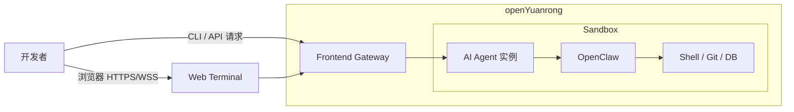
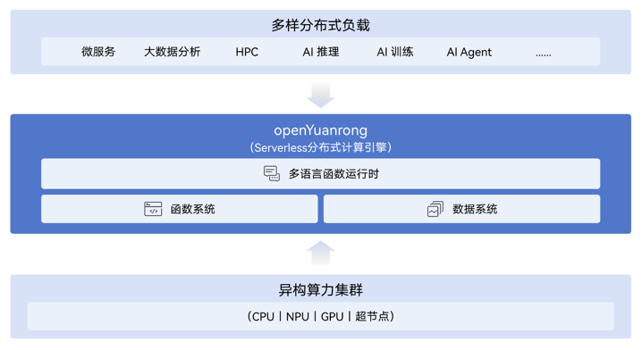
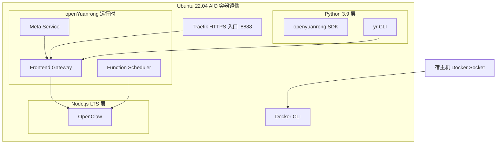

# openYuanrong 运行 OpenClaw 实战指南

## 引言

在 AI 时代，本地 Agent 工具正在重新定义人机协作的方式。OpenClaw（曾用名 Clawdbot）是一款具备高度主动性的本地 Agent 工具，它深入系统底层，可执行 Shell 命令、自动化提交 Git PR、管理数据库。

但 OpenClaw 依赖复杂的本地环境配置：Node.js、Python、Docker、各类 API Key...每一步都可能让开发者望而却步。

**openYuanrong（元戎）** 作为一款 Serverless 分布式计算引擎，提供了一种全新的解决思路——将完整的 AI Agent 运行环境封装到一个容器镜像中，用户只需启动容器，就能直接使用这些强大的 AI 工具。

本文将详细介绍如何基于 openYuanrong 运行 OpenClaw，带你体验「一键启动，即刻使用」的便捷。



<!-- 备选静态图： -->

---

## 一、技术架构解析

### 1.1 openYuanrong 沙箱的核心能力

openYuanrong 是 openEuler 社区开源的 Serverless 分布式计算引擎，其核心设计理念是**以单机编程体验简化分布式应用开发**。在 AI Agent 场景中，openYuanrong 提供了：

- **多语言运行时**：支持 Python、Java、C++、Go 等多种编程语言
- **函数即服务**：每个 AI Agent 作为一个「函数」运行，实现资源隔离和弹性伸缩
- **Web 终端**：内置浏览器终端，通过 WebSocket 实时交互


### 1.2 镜像设计

`yuanrong/example/aio` 目录提供了完整的沙箱镜像实现，其核心组件包括：

```
┌─────────────────────────────────────────┐
│         Ubuntu 22.04 容器镜像            │
├─────────────────────────────────────────┤
│  Python 3.9 (源码编译)                  │
│  ├── openyuanrong SDK                   │
│  └── yr CLI 工具                        │
├─────────────────────────────────────────┤
│  Node.js LTS                            │
│  └── OpenClaw (openclaw)                │
├─────────────────────────────────────────┤
│  Docker CLI (支持嵌套 Docker)            │
├─────────────────────────────────────────┤
│  openYuanrong 运行时服务                │
│  ├── Frontend Gateway (HTTP/WS)         │
│  ├── Function Scheduler                 │
│  └── Meta Service                      │
└─────────────────────────────────────────┘
```



<!-- 备选静态图： -->

---

## 二、快速部署

### 2.1 一行命令启动

无需任何配置，一条命令即可启动完整的 AI Agent 运行环境：

```bash
docker run -d \
  -p 8888:8888 \
  -v /var/run/docker.sock:/var/run/docker.sock \
  swr.cn-southwest-2.myhuaweicloud.com/openyuanrong/openyuanrongaio:latest
```

启动后访问 Web 终端：`https://127.0.0.1:8888/terminal`

> 容器镜像默认仅开启 **HTTPS**（8888），不提供 HTTP 明文端口。


---

## 三、进入 Agent 世界

### 3.1 OpenClaw 使用指南

在 Web 终端中执行（Token 与 API Key 配置见附录 A）：

```bash
# 非交互式初始化
openclaw onboard \
    --non-interactive \
    --accept-risk \
    --auth-choice zai-cn \
    --skip-channels \
    --skip-skills \
    --skip-ui

# 启动 Gateway 服务
openclaw gateway >> openclaw.log 2>&1 &

# 启动 TUI 界面
openclaw tui
```


OpenClaw 的核心优势在于其 **Skills 插件机制**。你可以安装各种 Hooks 来扩展功能：

- `boot-md`：自动生成启动报告
- `command-logger`：记录所有执行的命令
- `session-memory`：记住会话上下文

---

## 四、自定义镜像构建

### 4.1 核心配置文件

镜像构建涉及以下关键文件：

**services.yaml** - 定义运行时服务：

```yaml
- service: defaultservice
  kind: yrlib
  functions:
    py39:
      runtime: python3.9
      rootfs:
        imageurl: "swr.cn-southwest-2.myhuaweicloud.com/openyuanrong/openyuanrongaio:latest"
      bootstrap:
        entrypoint: "python3.9 -m yr.cli.scripts runtime_main"
```

**bootstrap** - 容器启动入口：

```bash
export CONTAINER_EP=unix:///var/run/runtime-launcher.sock
/openyuanrong/runtime-launcher >> /tmp/yr_sessions/runtime_launcher.log 2>&1 &
yr start --master \
    --port_policy FIX \
    --enable_faas_frontend=true \
    --enable_function_scheduler true \
    --ssl_base_path /openyuanrong/cert \
    --frontend_ssl_enable true \
    -p /openyuanrong/services.yaml
```

### 4.2 构建自定义镜像

```bash
cd yuanrong/example/aio

# 确保启用 BuildKit
export DOCKER_BUILDKIT=1

# 构建镜像
docker build -t my-ai-sandbox:latest .
```


---

## 五、架构设计亮点

### 5.1 分层构建优化

Dockerfile 采用多阶段构建：

- **第一阶段**：编译 Python 源码（减少最终镜像大小）
- **第二阶段**：仅复制运行时所需文件

配合 BuildKit 的 `--mount=type=bind` 特性，安装 pip 包不增加镜像层大小。

### 5.2 嵌套 Docker 支持

镜像中包含 Docker CLI，通过挂载宿主机的 `/var/run/docker.sock`，在容器内也能运行 Docker 命令，实现真正的「容器内建容器」能力。


### 5.3 TLS 安全通信

openYuanrong 运行时默认启用 TLS 加密：

- 证书文件挂载到 `/openyuanrong/cert/`
- 容器镜像默认仅开启 HTTPS（8888）
- 支持双向认证
- API Key 等敏感信息全程加密传输

---

## 六、结语

通过 openYuanrong 沙箱，AI Agent 的使用门槛被大幅降低。用户无需关心环境配置、依赖安装、版本兼容等繁琐问题，只需启动容器，就能直接进入 AI 辅助编程的工作流。

这正是 Serverless 架构的魅力所在——让开发者专注于业务逻辑，而非基础设施。无论是个人开发者快速体验，还是企业级部署 OpenClaw，openYuanrong 都提供了一种优雅的解决方案。


---

## 附录 A：Token 生成与输入

### A.1 生成 OpenYuanrong Token

进入容器后执行以下命令生成 token：

```bash
curl -k -X POST "https://127.0.0.1:8888/admin/v1/login" \
  -H "Content-Type: application/json" \
  -d '{"username":"admin", "password":"123456"}'
```

返回示例：

```json
{
  "code": 0,
  "message": "success",
  "data": {
    "token": "eyJhbGciOi..."
  }
}
```

请复制 `data.token` 字段，用于后续 OpenClaw 配置。

### A.2 在 OpenClaw 中输入 Token

在 OpenClaw 的配置界面中填写：

- Base URL：`https://127.0.0.1:8888`
- API Key：上一步生成的 `token`

保存配置后即可连接 OpenYuanrong 服务。

---

## 七、相关资源

- openYuanrong 官网：https://openyuanrong.org
- 示例代码：`yuanrong/example/aio`
- 文档中心：https://pages.openeuler.openatom.cn/openyuanrong/
